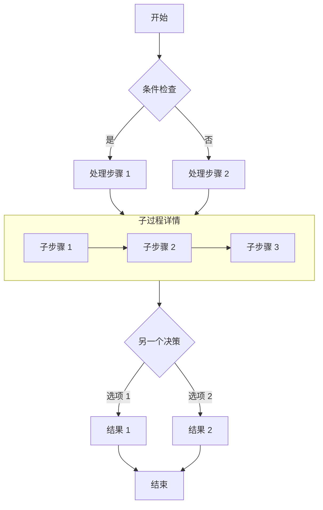
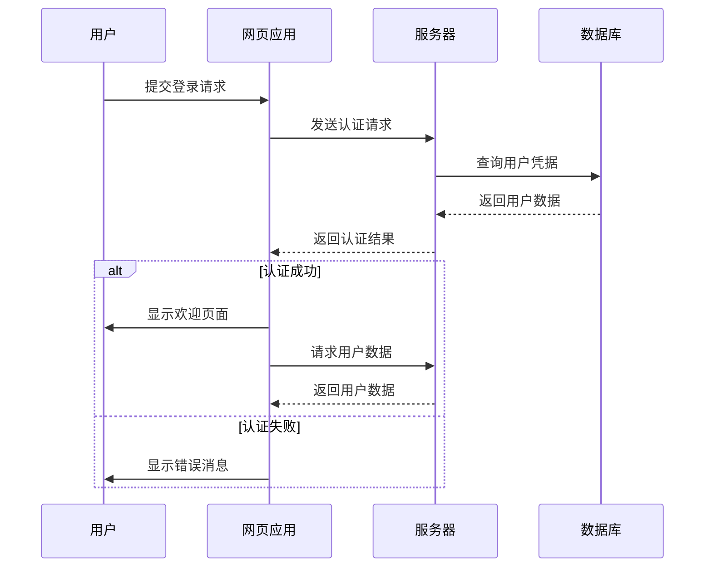
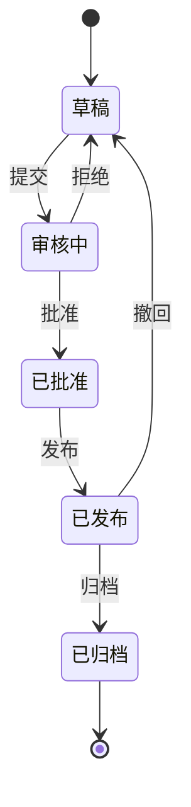
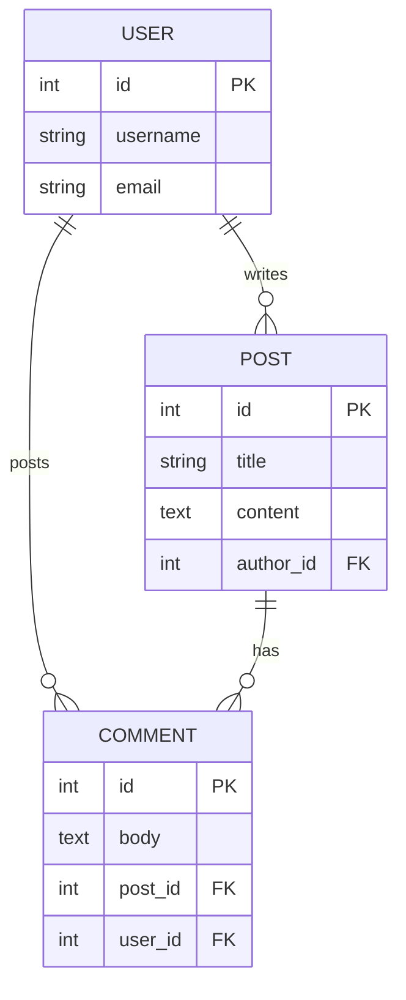
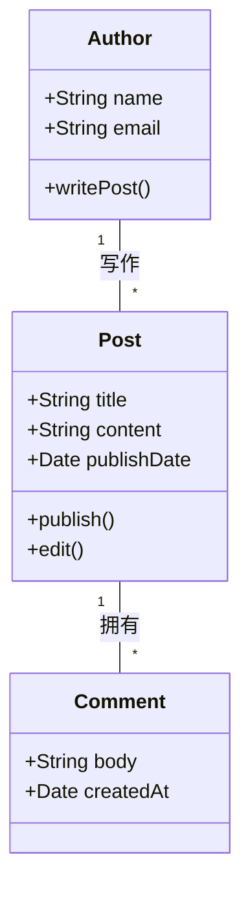
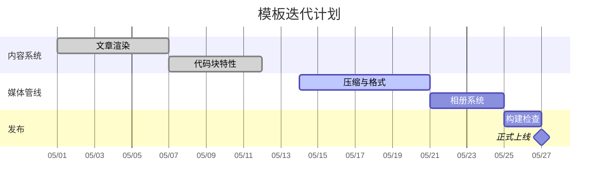
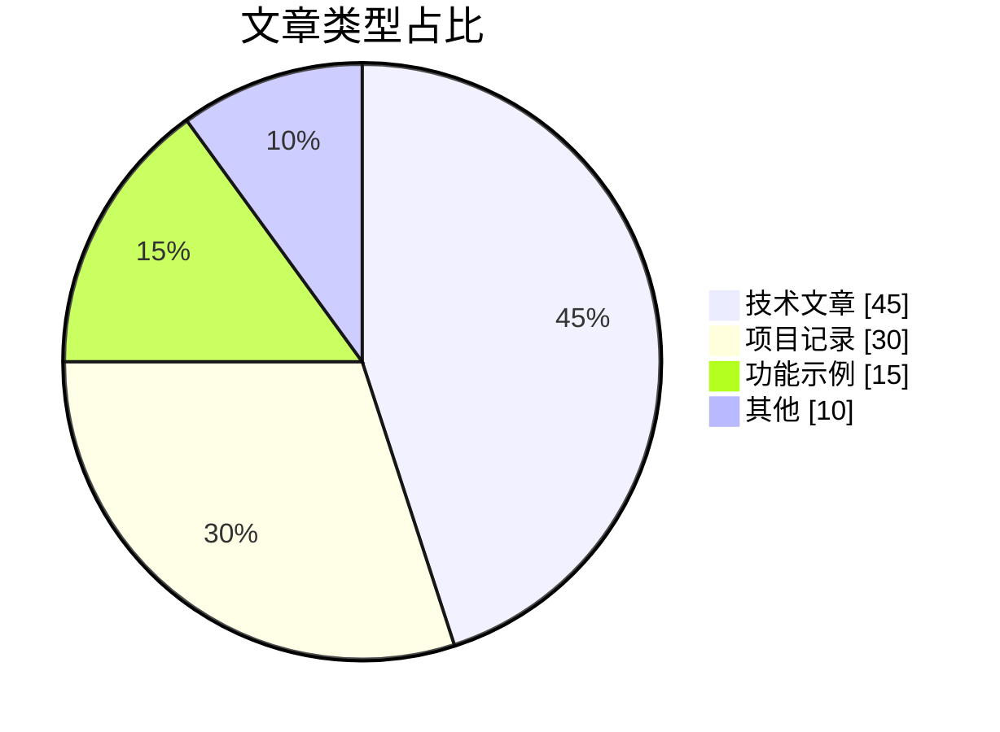
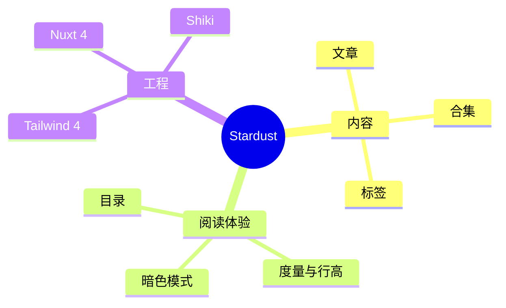
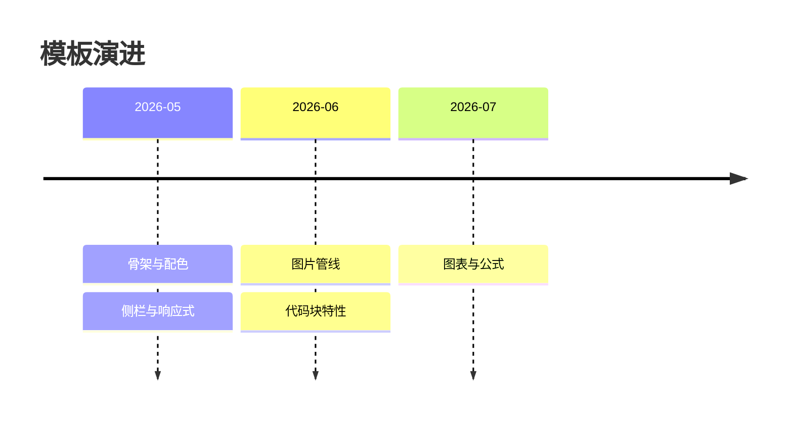
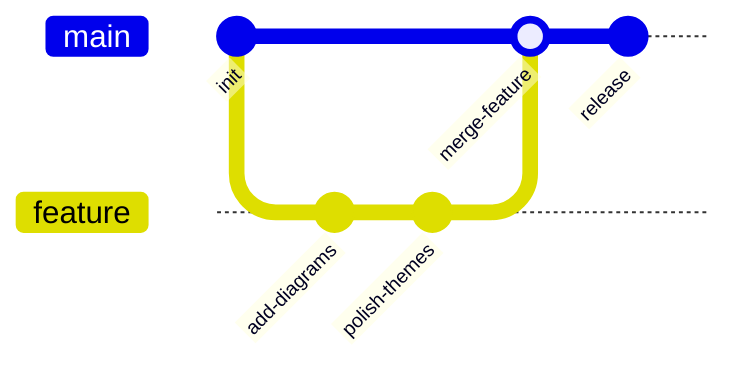

图表的源码就是文章的一部分，改图只需要改文本，也能进 diff。写法是普通的 ` ```mermaid ` 代码块。

## 渲染方式

Mermaid 需要真实的 DOM 测量才能排版，所以在**浏览器端**渲染：页面里出现图表时才会按需下载渲染器，滚动到图表附近才开始画，首屏不受影响。

脚本没跑起来时，图表位置会显示源码——内容不会丢。

## 流程图



## 时序图



## 状态图



## ER 图



## 类图



## 甘特图



## 饼图



## 思维导图



## 时间线



## Git 图



## 主题

图表配色跟着站点走——亮色和暗色各渲染一份，切换主题时直接替换，不用重新排版。配色取自锁定色板的同族色，不会在页面里跳出一块突兀的蓝紫。

写图表时不需要为暗色模式做任何额外处理。

> [!TIP]
> 图表渲染失败（语法写错）时，代码块里会显示具体的报错信息，同时保留源码。
> 这比只留一块空白要好排查得多。
