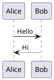
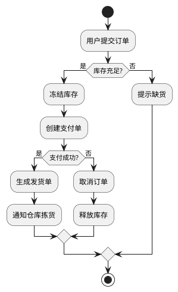
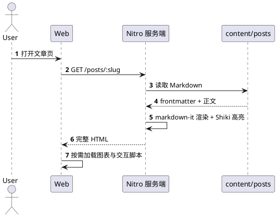
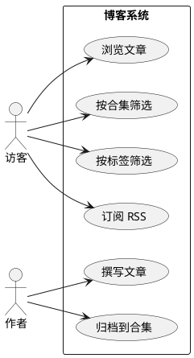
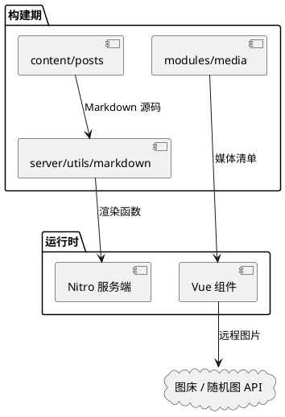
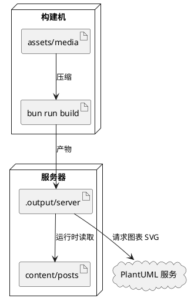
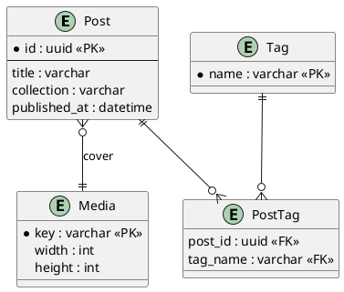
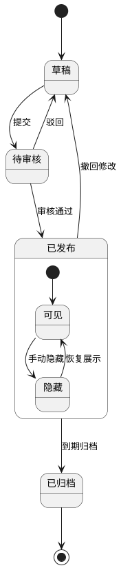

PlantUML 用纯文本描述图表，适合写进技术文档：图和正文一起做版本管理，改图只改文本。

## 渲染方式

与 Mermaid 不同，PlantUML 在**渲染阶段**就把源码编码成服务端 SVG 地址，页面端只加载一张图片，不需要任何 JavaScript。

代价是图表源码会随 URL 发给 PlantUML 服务。介意的话把 `blog.config.ts` 里的 `diagramConfig.plantuml.server` 指向自建实例即可。

## 最小示例

## 活动图

## 时序图

## 用例图

## 组件图

## 部署图

## ER 图

## 状态图

> [!NOTE]
> 图源地址里包含图表源码的压缩编码，同一段源码每次编码结果相同，
> 因此浏览器缓存可以正常命中，翻页来回看不会重复请求。
