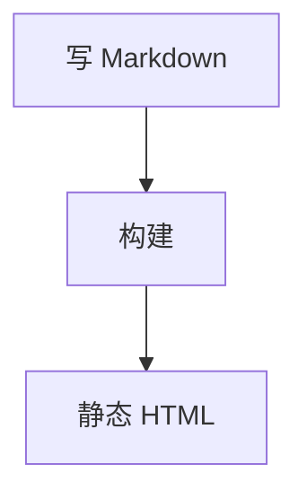
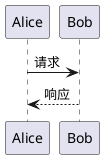

# 写文章

这篇写给往站点里加文章的人：frontmatter 有哪些字段、合集怎么建、Markdown 支持哪些扩展语法。全部内容都是仓库里的纯文本文件，写完保存就能在开发服务器上看到。

## 新建一篇文章

在 `content/posts/` 下放一个 `.md` 文件，文件名就是 URL：

```
content/posts/
  reading-first/
    _collection.md
    measure-for-cjk.md          →  /posts/measure-for-cjk
  loose-post.md                 →  /posts/loose-post
```

文件夹只负责归档，**不进 URL**，所以文件名要在全站唯一。文件名也要用 ASCII：详情页对 slug 做白名单校验（`^[A-Za-z0-9][A-Za-z0-9._-]*$`），中文或空格文件名能出现在列表里，但点开是 404。

只扫描 `content/posts/` 一层子文件夹，合集里再套文件夹不会被收录。文件必须是小写 `.md` 后缀，`.mdx` 与 `.markdown` 都不认。下划线开头的文件（`_collection.md`）被当作元信息，不当文章。

## frontmatter

```markdown
---
title: 标题
description: 一句话摘要
date: 2026-01-12
updated: 2026-03-02
tags: [nuxt, design]
cover: covers/hydrangea
pinned: true
---

正文……
```

| 字段 | 类型 | 默认 | 说明 |
| --- | --- | --- | --- |
| `title` | string | 文件名 | 列表与详情页标题，同时进 `<title>` |
| `description` | string | 空 | 卡片摘要、列表页描述与 SEO 描述 |
| `date` | string | 空 | 发布日期，写 `YYYY-MM-DD`；空的排在最后 |
| `updated` | string | 空 | 最后更新日期。页脚的过时提示按它判断，没写时回退 `date` |
| `tags` | string[] 或 string | `[]` | 支持 `[a, b]` 与单个值两种写法 |
| `cover` | string | 空 | 封面：`assets/media` 的素材 key 或图床链接；留空回落到随机图 |
| `pinned` | boolean | `false` | 置顶，优先于日期排序 |

日期用 ISO 格式（`YYYY-MM-DD`）。排序拿字符串直接比大小，写成别的格式会排到错误的位置。

frontmatter 由 `server/utils/frontmatter.ts` 解析，只认 `键: 值` 与 `[a, b]` 两种形式，刻意没有引入 `gray-matter` 或 `js-yaml`。解析不了的行会被跳过，不会让整篇文章挂掉。需要嵌套结构时替换这个文件即可。

`updated` 只在页脚显示，不影响排序；列表排序只看 `pinned` 与 `date`。

## 合集

合集就是一个文件夹。

```
content/posts/
  reading-first/
    _collection.md              ← 标题、描述、排序写在这里
    reading-first-typography.md
    measure-for-cjk.md
  build-log/
    _collection.md
    tooling-choices.md
  loose-post.md                 ← 也可以直接放在顶层，不归属任何合集
```

`_collection.md` 用 frontmatter 描述这个合集，`slug` 就是文件夹名：

```markdown
---
title: 阅读优先
description: 排版、度量与长文阅读体验。
order: 1
---

正文可以留空。
```

| 字段 | 默认 | 说明 |
| --- | --- | --- |
| `title` | 文件夹名 | 合集的展示名 |
| `description` | 空 | 合集入口的说明文字 |
| `order` | 排在最后 | 排序权重，数字小的在前；相同则按文件夹名 |

`order` 不写时排在所有带 `order` 的合集之后。文件缺失也能工作，标题回退成文件夹名。写成 `_collection.txt` 也行，那时正文第一行被当作描述。

文章的归档关系完全由文件位置决定，frontmatter 里不需要也不能用 `collection:` 字段声明归属。把文章在合集之间搬家不会忘记改字段，也不会改变它的链接。

## 标签

标签是文章自带的自由词，不需要注册，写在 `tags` 里就能用。`/contents` 会统计每个标签的出现次数并按次数倒序排列，`/tags/:tag` 是标签的时间线页面。

标签页是数据驱动的：拼错的标签返回空列表，不会 404。

## 排序

列表统一按「置顶优先，其后日期倒序」排列。这个顺序同时用于首页、`/contents`、合集页与标签页。

置顶的标识由 `app/components/blog/PinnedBadge.vue` 提供（图钉加 `Pinned` 文字），卡片、时间线、详情页共用同一个组件。

## 提醒框

GitHub 风格的引用块写法，第一行写 `[!类型]`，后面可以跟自定义标题：

```markdown
> [!NOTE] 自定义标题
> 正文。
```

支持的类型与别名：

| 类型 | 别名 |
| --- | --- |
| `note` | `info`、`abstract`、`summary`、`tldr`、`todo` |
| `tip` | `hint` |
| `important` | — |
| `success` | `check`、`done` |
| `question` | `help`、`faq` |
| `warning` | — |
| `caution` | `attention` |
| `failure` | `fail`、`missing` |
| `danger` | `error` |
| `bug` | — |
| `example` | — |
| `quote` | `cite` |

`:::` 容器是等价的另一种写法，还能表达折叠块：

```markdown
:::tip
正文。
:::

:::warning[自定义标题]
正文。
:::

:::details[点开看更多]
折叠起来的内容。
:::
```

不写标题时用类型的中文名（笔记、提示、警告……）作为标题。认不出的容器名会退化成普通区块，内容不丢。

提醒框默认只用图标与描边粗细区分轻重，颜色取自锁定色板。想换成带语义色的版本，把 `blog.config.ts` 里的 `markdown.admonitionsColorful` 打开；关掉 `markdown.admonitions` 则全部退回普通引用块。

## 剧透

```markdown
答案藏在 :spoiler[这里]。
```

渲染成一个可聚焦的 `span`，内容用 CSS 模糊，悬停或键盘聚焦时展开。内容照常按 Markdown 解析，里面可以放链接与行内代码。

## 图片网格

```markdown
[grid]


[/grid]
```

按图片数量自适应列数，两张两列、三张三列、四张四列，最多并排四张。更少或更多都落到默认的自动填充布局。

## GitHub 仓库卡片

```markdown
::github{repo="nuxt/nuxt"}
```

独占一行的写法，渲染时请求 `api.github.com` 取 star、fork、语言与协议，结果在进程内缓存 30 分钟。未认证的接口每小时 60 次，超限或断网时降级成一张静态卡片，链接照常可用。

不想要出站请求就把 `blog.config.ts` 里的 `markdown.githubCard` 关掉。

## 数学公式

`$行内$` 与 `$$块级$$` 两种，由 KaTeX 在服务端渲染成静态 HTML，页面端不加载数学排版脚本。行内公式不会把段落行高撑开。

```markdown
行内：$E = mc^2$

块级：

$$
\sum_{i=1}^{n} x_i
$$
```

矩阵、多行对齐、分段函数这些 KaTeX 原生语法都可以直接用，示例见 `content/posts/showcase/katex-math.md`。

## Mermaid

用 `mermaid` 作语言标记的代码围栏，浏览器端按需渲染：

````markdown

````

图表源码是文章的一部分，改图只改文本，也能进 diff。渲染器在页面里真的出现图表时才下载，滚动到图表附近才开始画，首屏不受影响。脚本没跑起来时，图表位置显示源码，内容不会丢。

每个图表只渲染当前主题那一次，切到另一套主题时才补上。示例见 `content/posts/showcase/mermaid-diagrams.md`。

## PlantUML

同样是一个代码围栏，渲染阶段把源码编码成服务端 SVG 地址，页面端只加载一张图片：

````markdown

````

代价是图表源码会随 URL 发给 PlantUML 服务。介意的话把 `blog.config.ts` 里的 `diagrams.plantuml.server` 指向自建实例，见[部署](deployment.md)。

`participant FS as content/posts` 这种别名含 `/` 的写法不合法，整块会报 `Syntax Error`。把显示名加引号、别名保持简单就行：

```plantuml
participant "content/posts" as FS
```

示例见 `content/posts/showcase/plantuml-diagrams.md`。

## 代码块

窗口框架按语言自动选择：终端类语言（`bash`、`sh`、`powershell`、`zsh` 等，完整列表在 `blog.config.ts` 的 `codeBlocks.terminalLanguages`）套 mac 终端窗口，其余套编辑器窗口。用 `title=` 补文件名，用 `frame=` 强制指定。

````markdown
```bash
echo "终端窗口，左上角是 mac 的三个圆点"
```

```js title="app.js"
console.log('编辑器窗口，左上角显示文件名')
```

```yaml frame="none" title="没有窗口框架"
key: value
```
````

`frame` 取 `auto`（默认）、`code`、`terminal`、`none`。

行数达到阈值（默认 3 行）就自动显示行号，也可以用 `showLineNumbers` / `showLineNumbers=false` 显式控制，`startLineNumber=5` 从指定行起算。

行标记有三种语义：

````markdown
```js title="line-markers.js" del={2} ins={3-4} {6}
function demo() {
  console.log('此行标记为已删除')
  // 此行和下一行标记为已插入
  console.log('这是第二个插入行')

  return '此行使用中性默认标记'
}
```
````

`{…}` 是中性标记，`ins={…}` 是插入，`del={…}` 是删除，`mark={…}` 与裸 `{}` 等价。区间写 `3-4`，多个区间用逗号分隔。标记可以带标签，标签贴在行尾：

````markdown
```js {"第一步：取值":1} del={"移除这段":3-4}
```
````

折叠与换行：

````markdown
```js collapse={1-5,21-24}
// 这几个区间默认折起来
```

```js collapse
// 整块默认折叠
```

```text wrap
// 用自动换行代替横向滚动
```
````

终端窗口那三个圆点的颜色由 `codeBlocks.terminalDots` 决定，`classic` 是 mac 的红黄绿，`palette` 改用锁定前景色。

### 标签页

用 `::: code-group` 包住若干代码块：

````markdown
::: code-group labels=[code.js, code.py]

```js
export function greet(name) {
  return `Hello, ${name}!`
}
```

```py
def greet(name):
    return f"Hello, {name}!"
```

:::
````

标签文字写在 `labels=[…]` 里，省略时用语言名。标签里可以写 `:package:` 这类短代码，支持的短代码在 `server/utils/markdown/blocks.ts` 的 `EMOJI` 表里。

标签栏放哪儿由组内内容决定，不需要额外标记：

| 组的情况 | 标签栏位置 |
| --- | --- |
| 都是代码块、且都没写 `title=` | 落进代码窗口的标题栏，占掉空着的文件名位子 |
| 有面板写了 `title=` | 留在组的上方 |

终端窗口的圆点始终保留，标签栏排在圆点之后。渲染时会写上 `data-tabs="bar"` 或 `"top"`，方便核对走的是哪条路径。

标签切换是纯 CSS 实现的（radio + `:checked`），没有 JavaScript 参与，首屏不会出现所有面板同时可见的闪烁，键盘用方向键就能切换。代价是标签上限 8 个；真要更多，改 `app/assets/css/content.css` 里的选择器数量。

### 语法高亮

Shiki 高亮，亮暗两套 token 颜色由同一个主题程序化派生，切换主题时不会换一套配色。派生规则、对比度实测与校验脚本见[设计系统](design-system.md)。

## 阅读时间与字数

卡片与详情页展示预估阅读时间，基准是拉丁 265 词/分钟、中日韩 300 字/分钟，代码块不计入。总字数按「CJK 按字、拉丁按词」相加，用于 `/statistics`。两处口径都由 `shared/utils/reading-time.ts` 提供。

## 示例文章

`content/posts/showcase/` 下的五篇覆盖上面全部语法，都在「功能示例」合集里，可以直接抄：

| 文章 | 内容 |
| --- | --- |
| `content/posts/showcase/markdown-extended.md` | 提醒框、剧透、图片网格、仓库卡片 |
| `content/posts/showcase/code-blocks.md` | 窗口框架、行号、行标记、折叠、标签页 |
| `content/posts/showcase/katex-math.md` | 行内、块级、矩阵、对齐多行 |
| `content/posts/showcase/mermaid-diagrams.md` | 流程图、时序图、状态图、甘特图、思维导图 |
| `content/posts/showcase/plantuml-diagrams.md` | 时序图、活动图、用例图、组件图、部署图、ER 图 |
